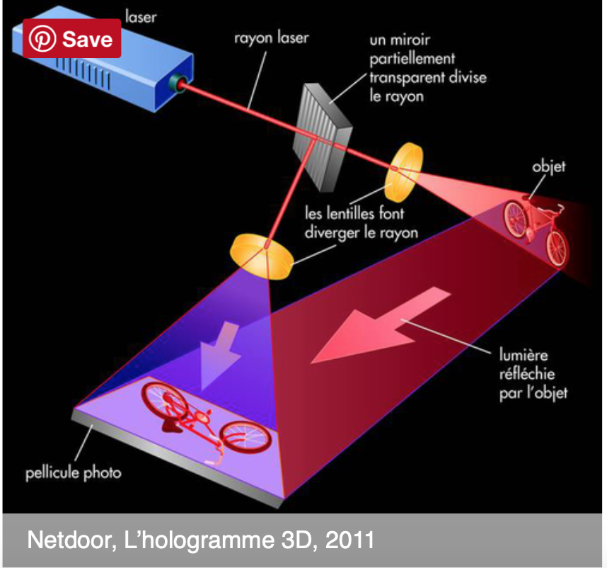

# Digital Botany; The future of Green Living

Go to this [link](https://guides.github.com/features/mastering-markdown/) for help with bold, italics, and more

The image you see above is a regular living room decorated with plants. Interior plants are an ideal way to create attractive and restful settings. While making us feel more comfortable and relaxed, they also make a room look more alive. For some individuals, owning real plants isn’t possible — they’re either away too much to take care of them, they have allergies or the shadows of their home or dark apartment won’t allow the plants to survive. Very few plants will survive neglect but if you love decorating your home with plants, but are too busy to look after them, then  consider digital horticulture, which is an adapted concept of botanical. 
As a blacked-thumbed botanical artist whose focus is on indoor botanical and practical designs, I went searching on how technology, like artificial plants can be involved in providing low maintenance botany that enhances our world at home and in the workplace. For my final project I will use real fresh plants as my artifact and I will further discuss how holographic techniques combined with modern augmented reality technology can incorporate plants and reinvent the botanical experience into something beautiful and practical. 
## Why Digital Botany (150-250 words)
When most of us are decorating our home or business, many of us take a few cues from hospitality professionals such as those who work in hotels, and spas. All over the world, the most desirable hotels, spas and resorts incorporate plants into their design because of the natural beauty these quiet, living greenery bring to any environment. Many busy high-end home owners might opt for a pricey designer in order to create real botanical art installations, which may also require them to hire a professional gardener to care for them. Meanwhile, some people have the knack for growing the most delicate plants, seemingly with no effort while other people like myself have a collection of empty pots stacked around their house as a testament to their failed attempts at nurturing greenery. 

The Collins Dictionary describes Floriography (the language of flowers) as “a means of cryptological communication through the use or arrangement of flowers’’ [4]. According to studies, flowers have an immediate impact on happiness; have a long-term positive effect on moods and set the scene for people to make more intimate connections with others [7]. A well-selected flower arrangement will be appropriate at any momentous occasion - be it a formal event, a wedding, a funeral or as a gift to a loved one. Special occasions such as weddings, anniversaries and birthday parties look dull when women are not wearing accessories on such occasions (Jessup 1950). 

Holograms are an example of a machine interacting with our environment by adding botanical information (output perspective).  Imagine being able to incorporate augmented reality, holograms and glass technology to this perspective!  I combine these technologies into a simple matrix. Digital botany offers the opportunity for a piece of Mother Earth to the benefit of both humans and green living. The following video shows the journey some French artists who are already working on a digital botany project that allows people to feel, listen to or even touch the product during an original sensory journey.

According to Guy Debor, in The Society of the Spectacle, passivity was simultaneously the means and the end of a great hidden project, a project of social control. On the terms of its particular form of hegemony the spectacle naturally produced by spectators, not actors: modern men and women, citizens of the most advanced societies on earth, who were thrilled to watch whatever it was they were given to watch (The Society of the Spectacle, p. 99). Based on this statement should we find the theory of spectacle in many forms available to watch. In the following paragraphs, I will provide a brief description of holographic, augmented reality, virtual reality along with a few examples of how glass technology works.

https://vimeo.com/3870152?cjevent=4db2704c8c1b11e9823d00520a1c0e14
## History of hologram and augmented reality
(Hologram vs Augmented Technology)
Wikipedia describes the science of holography as follows: “Holography is a technique which enables three-dimensional images (holograms) to be made. 

 

In this version the flowers are uniquely generated.

See full video “Daisy 2.0” here: https://vimeo.com/3870152?cjevent=4db2704c8c1b11e9823d00520a1c0e14

See full video “Projections in the forest” here:
https://vimeo.com/115082758

## Holographic reality
The principle of holography was discovered by famous theorist Dennis Gabor in 1948. A hologram is a 3D image recorded on a two-dimensional photographic film allowing a 360° capture of the object. It is therefore a recording process for rendering a 2D image in 3D (See image 1). When we photograph an object in a conventional way, we record on a sensitive plate the brightness of the various points of the object. In other words, only the intensity of the light reflected by the object in question is taken into account. The hologram is, for its part, the result of the interference of two laser beams, one sent on a photographic plate, the other on the object to be holographed. It is from this interference that a 3D image is printed on the photographic plate. The object to holography, illuminated by a laser beam reflects the light part which arrives on the photographic film, the other part passes through a semi-reflective mirror and is used to produce the coveted 3D image.

Image 1                                                            

Furthermore, some holograms that are currently on the market can be programed to change when touched. Touches are registered using a camera positioned underneath the hologram, and the information is subsequently relayed back to a computer which changes the holographic image.
You can see some of the incredible applications of this technology [here](https://www.youtube.com/watch?v=AoWi10YVmfE&feature=youtu.be):

Applications for holograms have been limited by cumbersome techniques, high computation requirements, and poor image quality. Glass technology as shown in the following video could lead to a wide variety of applications, including viewing 3D plants without the need for glasses. Glass technology techniques just like the contemporary holographic techniques also find their niche in home design and commercial sales and marketingwatching holographic videos on television and smart phone screens (See images 3 & 4). As described by famous 
Future of Glass Video

Image 3                                                                                   https://www.youtube.com/watch?v=jZkHpNnXLB0
 

## Augmented Reality
Holograms can create realistic 3D images and place photos in your surroundings. It is also known as Augmented Reality - it is nothing but augmenting something into your own reality.

## Virtual Reality
As opposed to Augmented Reality, users of virtual reality no longer perceive their real environment. Virtual reality makes it possible to experience simple things such as 360-degree images, 360-degree videos – which everyone can also produce themselves – and complex applications such as virtual reality games or special virtual reality applications, e.g. for the automotive industry, medical technology, the tourism sector, or even innovative systems such as VR configurators.

Moreover, the company Snap has found a new niche in its Snapchat augmented reality offerings for brands by merging traditional and digital advertising tactics in an immersive experience.by merging traditional and digital advertising tactics in an immersive experience. The company recently demonstrated how brands could leverage the approach with an AR billboard
Augmented reality has already become a popular technology for the NBA and its teams. Thinking of how that combined with other technologies be applied. That’s next level exciting.

 

## Glass technology
The future of how you interact with computers depends on a technology that's more than 3,000 years old. It's a technology you already use every day, on your smartphone, your TV, in your home, your car and most likely at work. It's even in the wires that bring you Internet service at near-light speed. 
Is about transparent, holographic waveguide displays, glass technology that makes the images appear as if they're in the real world, so there's less distraction to look away. This is a technology that not only can be used in the care to display a GPS but   that could be used on any window at home See image 4)

Image 4. 

The Adaptation (150-250 words)
Before Adaptation (Fresh Plants)
Before Adaptation

After Adaptation

Formal Qualities (200-300 words)

Image 2

How the advanced technology will be used will also define the typographic hierarchy. For example, when holographic technology or advance reality use the projection of a plant image for the basic purposes of substituting a real plant in someone’s home (See image 2), it would be defined as a level one, which only shows the basic such as the image. In this case, most of the attention would be focused on the realistic shape and size of the design to ensure integrity to the original text as much as possible. 
In contrast the use of holographic in advance technology for the purpose of marketing (See image 6) may require a more in-depth typography hierarchy. For example, a three level typography hierarchy would include the product name (pink blazer) as a level one; the price will be level two, and to complete the product description will be recognized as the level three.

## Rhetorical Significance (200-300 words)

Image 5                                                     Image 6

 

One of the oldest (and most important) theories about persuasion was formulated by the ancient Greek philosopher Aristotle, who lived and worked from 384 to 322 BC. 
Rhetoric as defined by Aristotle is a mean of “human communication that is designed to influence or change a person’s (or a group’s) beliefs, attitudes, intentions, motivations, or behaviors.” In a public presentation, persuasion often boils down to the ability of the speaker to appeal to his audience. 

Holograms in human and in augmented technology forms are an effective form of rhetoric as it offers the audience a very special illusion of the presence of the person represented. We interact with them as with real humans, that is, by speech (See image 5). Furthermore, the holographic form of display enhances the value of products, brands and organizations and attracts passers-by with an innovative concept that appeal the audience (See figure 6). A good business narrative taps into the targeted audience personal strengths and experience, appeals to the specific audience in the room and calls them for a conscious call to action. In contrast, Slavoj Zizek theory is arguing that there's an "element of hypocrisy" involved in conscious consumerism.  He believes that not only our reality enslaves us but that most importantly we are subjects dictatorship ideologies within democracy that control our mind in convincing us through emotions of pleasure and control. That resulting emotion is obtained through manipulation that leads us to unconsciously submit. Holographic images in business is in fact one more tool available to further manipulate us in a deliberate and coordinated way on a very large scale through mass-marketing techniques, to the advantage of sellers. Even more, based on Foucaulidian notion, these technologies could be used as another way to unparallelly intervene into the  lives of its citizens by analyzing, and attempting to regulate and discipline, their bodies and behavior. 

Read more at https://www.business2community.com/marketing/rhetoric-storytelling-persuasion-01416534 

 If used for the purpose of marmy hologram I might consider the grid of my image, the layout, hierarchy, or even the typeface. Go back through your Slack posts and select the formal aspects of the image that you deem to be most important. I would select at least 2-3 formal qualities. It might be helpful to compare and contrast your adaptation to the original.

## Cultural Meaning (200-300 words)
Just as with plastic plants, holographic botany would  look good and cost less to take care of. They require no fertilizers to grow and need little maintenance. As they are resistant to pests, you don't have to use pesticides and insecticides. These are just some of the benefits and advantages of owning faux plants rather than natural ones. According to theorist Guy Debord, holorgraphic plants are another form of detournement just as plastic plants. The most frequently cited— and partial—definition of detournement given by Guy Debord, the leader of the Situationist International. (Debord 1959, p55) stated generally that detournement entails “the reuse of preexisting artistic elements in a new ensemble” .

 
Roland Barthes (1977) writes that images do and don’t have a relationship to linguistic texts; imagery is a language, but it doesn’t work like linguistic language. I argue that in the case of plants that there’s a relationship between imagery and linguistic language. The Collins Dictionary describes Floriography (the language of flowers) as “a means of cryptological communication through the use or arrangement of flowers’’ [4]. According to studies, flowers have an immediate impact on happiness; have a long-term positive effect on moods and allow people to make connections that are more intimate [7]Floriography may not be as prevalent in society today as it used to be in the victorian era but still is used to communicate messages of emotions along with a certain wanted ambiance in someone’s home.
 
In this section, I’m going to investigate the cultural implications of my adaptation. You might want to select a particular theorist that helps you interpret your own artifact and/or process (e.g. Foucault, Barthes, Bourdieu, Stuart Hall, De Certeau, or someone else). It’s really important that you engage with key words for the text/author you choose, define that term, and use it to inform a more well-rounded cultural analysis of your own adaptation.
Rhetorical Significance (200-300 words)
Images 8
## Reflection (150-250 words)
In conclusion, applications for holograms have been limited by cumbersome techniques, high computation requirements, and poor image quality. Improving current techniques could lead to a wide variety of applications, including 3D cinema viewing without the need for glasses, watching holographic videos on television and smart phone screens.

## Work Cited 

[4]	 “Definition of Floriography | New Word Suggestion | Collins Dictionary.” Accessed February 12, 2019.https://www.collinsdictionary.com/us/submission/11342/Floriography.

[6] 	Jessup, Ronald Frederick. 1950. Anglo-Saxon Jeweler. London: Faber and Faber.

[7]	 “6 Reasons Why Floral Designers Are Awesome!” Flowerweb. Accessed February 12, 2019.https://www.flowerweb.com/en/article/195685/6%2520Reasons%2520Why%2520Floral%2520Designers%2520are%2520Awesome%2521
[8]	https://www.instagram.com/parseerror/
