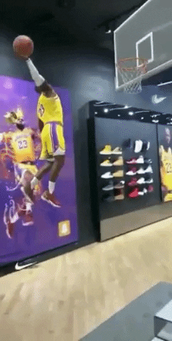
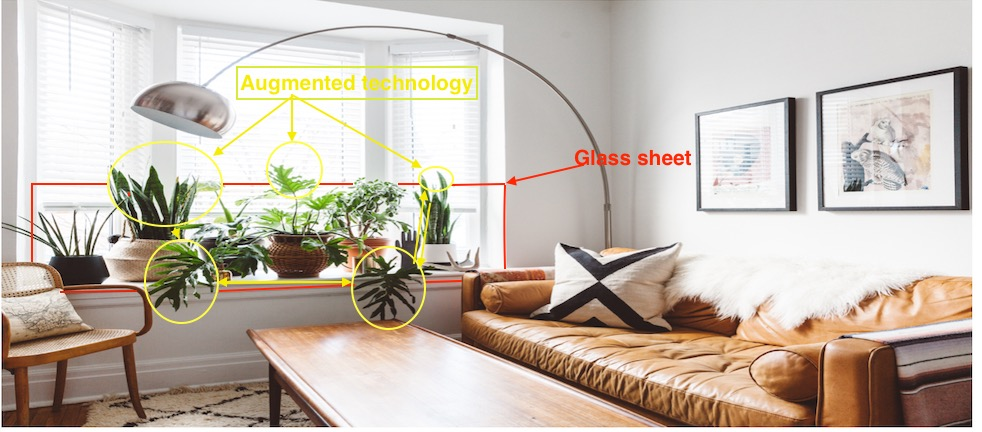
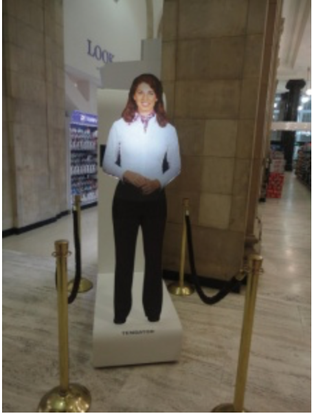

# Digital Botany; The future of Green Living

The image you see above is a regular living room decorated with plants. Interior plants are an ideal way to create attractive and restful settings. While making us feel more comfortable and relaxed, they also make a room look more alive. For some individuals, owning real plants isn’t possible — they’re either away too much to take care of them, they have allergies or the shadows of their home or dark apartment won’t allow the plants to survive. Very few plants will survive neglect but if you love decorating your home with plants, but are too busy to look after them, then  consider digital botany, which is an adapted concept of botanical. 
As a blacked-thumbed botanical artist whose focus is on indoor botanical and practical designs, I went searching on how technology, like artificial plants can be involved in providing low maintenance botany that enhances our world at home and in the workplace. For my final project I will use real fresh plants as my artifact and I will further discuss how holographic techniques combined with modern augmented reality technology can incorporate plants and reinvent the botanical experience into something beautiful and practical. 
## Why Digital Botany 
  When most of us are decorating our home or business, many of us take a few cues from hospitality professionals such as those who work in hotels, and spas. All over the world, the most desirable hotels, spas and resorts incorporate plants into their design because of the natural beauty these quiet, living greenery bring to any environment. Many busy high-end home owners might opt for a pricey designer in order to create real botanical art installations, which may also require them to hire a professional gardener to care for them. Meanwhile, some people have the knack for growing the most delicate plants, seemingly with no effort while other people like myself have a collection of empty pots stacked around their house as a testament to their failed attempts at nurturing greenery. 

The Collins Dictionary describes Floriography (the language of flowers) as “a means of cryptological communication through the use or arrangement of flowers’’ [1]. According to studies, flowers have an immediate impact on happiness; have a long-term positive effect on moods and set the scene for people to make more intimate connections with others [3]. Any well-selected flower arrangement will be appropriate at any momentous occasion - be it at home, for a formal event, a wedding, a funeral or as a gift to a loved one.  

According to Guy Debor, in The Society of the Spectacle, passivity was "simultaneously the means and the end of a great hidden project, a project of social control. On the terms of its particular form of hegemony the spectacle naturally produced by spectators, not actors: modern men and women, citizens of the most advanced societies on earth, who were thrilled to watch whatever it was they were given to watch" (The Society of the Spectacle, p. 99). Based on this statement should we find the theory of spectacle in many forms available to watch. In the following paragraphs, I will provide a brief description of holographic, augmented reality, virtual reality along with a few examples of how glass technology works. These are good example that support Guy Debord's argument of "The Society of Spectacle" as it offers modern and succesful elements that are given in to our current society to watch.

Holograms are an example of a machine interacting with our environment by adding botanical information (output perspective).  Imagine being able to incorporate augmented reality, holograms and glass technology to this perspective. Digital botany offers the opportunity to enjoy a piece of Mother Earth to the benefit of both humans and green living. The following video shows the journey some French artists who are already working on a digital botany project that allows people to feel, listen to or even touch the product during an original sensory journey.

 

## Hologram and Augmented Reality
(Hologram vs Augmented Technology)
  Wikipedia describes the science of holography as follows: “Holography is a technique which enables three-dimensional images (holograms) to be made. 

First Video (left)- Daisy 2.0 
In this version the flowers are uniquely generated.

Second Video (right)- Projections in the forest

        

See full video “Daisy 2.0” here: https://vimeo.com/3870152?cjevent=4db2704c8c1b11e9823d00520a1c0e14

See full video “Projections in the forest” here:
https://vimeo.com/115082758

## Holographic Reality History
  The principle of holography was discovered by famous theorist Dennis Gabor in 1948. A hologram is a 3D image recorded on a two-dimensional photographic film allowing a 360° capture of the object. It is therefore a recording process for rendering a 2D image in 3D (See image 1). When we photograph an object in a conventional way, we record on a sensitive plate the brightness of the various points of the object. In other words, only the intensity of the light reflected by the object in question is taken into account. The hologram is, for its part, the result of the interference of two laser beams, one sent on a photographic plate, the other on the object to be holographed. It is from this interference that a 3D image is printed on the photographic plate. The object to holography, illuminated by a laser beam reflects the light part which arrives on the photographic film, the other part passes through a semi-reflective mirror and is used to produce the coveted 3D image.

Image 1                                                            

  Furthermore, some holograms that are currently on the market can be programed to change when touched. Touches are registered using a camera positioned underneath the hologram, and the information is subsequently relayed back to a computer which changes the holographic image.
You can see some of the incredible applications of this technology [here](https://www.youtube.com/watch?v=AoWi10YVmfE&feature=youtu.be):

Applications for holograms have been limited by cumbersome techniques, high computation requirements, and poor image quality. Glass technology as shown in the following video could lead to a wide variety of applications, including viewing 3D plants without the need for glasses. Glass technology techniques just like the contemporary holographic techniques also find their niche in home design and commercial sales and marketingwatching holographic videos on television and smart phone screens (See images 3 & 4). As described by famous 
Future of Glass Video. see full video here: https://www.youtube.com/watch?v=jZkHpNnXLB0

Image 3                                                                                   
 

## Augmented Reality
  Holograms can create realistic 3D images and place photos in your surroundings. It is also known as Augmented Reality - it is nothing but augmenting something into your own reality.
Moreover, the company Snap has found a new niche in its Snapchat augmented reality offerings for brands by merging traditional and digital advertising tactics in an immersive experience.by merging traditional and digital advertising tactics in an immersive experience. The company recently demonstrated how brands could leverage the approach with an AR billboard
Augmented reality has already become a popular technology for the NBA and its teams. Thinking of how that combined with other technologies be applied. That’s next level exciting.

 

## Virtual Reality
  As opposed to Augmented Reality, users of virtual reality no longer perceive their real environment. Virtual reality makes it possible to experience simple things such as 360-degree images, 360-degree videos – which everyone can also produce themselves – and complex applications such as virtual reality games or special virtual reality applications, e.g. for the automotive industry, medical technology, the tourism sector, or even innovative systems such as VR configurators.

## Glass technology
  The future of how you interact with computers depends on a technology that's more than 3,000 years old. It's a technology you already use every day, on your smartphone, your TV, in your home, your car and most likely at work. It's even in the wires that bring you Internet service at near-light speed. 
Is about transparent, holographic waveguide displays, glass technology that makes the images appear as if they're in the real world, so there's less distraction to look away. This is a technology that not only can be used in the care to display a GPS but that could be used on any window at home See image 4)

Image 4. 

## My adaptation
Just as with plastic plants, holographic botany would look good and cost less to take care of. They require no fertilizers to grow and need little maintenance. As they are resistant to pests, you don't have to use pesticides and insecticides. These are just some of the benefits and advantages of owning faux plants rather than natural ones. There are still a few concerns about plastic and mine is an environmental one: plastic plants require resources (usually oil-based polymers and energy) to make.  And I doubt very much whether they are recycled very often. I believe that the use of digital technologies combines with botany would remedy to these environmental issues.

According to theorist Guy Debord detournement theory, holographic plants are another form of detournement just as plastic plants. The most frequently cited— and partial—definition of detournement given by Guy Debord, the leader of the Situationist International. (Debord 1959, p55) stated that detournement entails “the reuse of preexisting artistic elements in a new ensemble.” My futurist adaptation includes an area of existing technologies that were previously discussed.  You will notice in the following image (See Image 8) that my focus is mostly toward holographic methods, augmented technology along with smart glass technology. 

So firstly, there’s the process the audiences make in terms of understanding media representations and relating them to themselves. Then there’s looking at how the media construct representations (making a conscious selection of what to include and how to present it) to create identities for a specific individual or for a group of people. 

Bourdieu theorizes that class fractions teach aesthetic preferences to their young. Class fractions are determined by a combination of the varying degrees of social, economic, and cultural capital. The society incorporates "symbolic goods, especially those regarded as the attributes of excellence, [...as] the ideal weapon in strategies of distinction." [21] Those attributes deemed excellent are shaped by the interests of the dominating class. He emphasizes the dominance of cultural capital early on by stating that "differences in cultural capital mark the differences between the classes." [22] His view on class differences lead me to question to what extent is our identity constructed by media, to what extent do we use media, and to what extent does media reflect identity.

 Digital technologies offer such a beautiful and unique way to access botany. While artificial plants may not provide the same health effects than real ones, they still have a positive impact on psychology and on the health of different groups of people like low incomes, overworked and disable people just to name a few. In the case of individuals who are disabled, and cannot care for plants the way an able-bodied person, an individual with a disability might never have considered to become plant owners. With the apparition of botanical technology that reflects their identity and from which features may create a need along with an array of new possibilities that may never have been explored otherwise. The outcome of digital technologies combined with botany allows these disable individual not only to enjoy the beauty of nature but it decreases the spatial distance between them and other groups of people as discussed in Pierre Bourdieu's cultural–structuralist approach to conceptualizing and identifying social classes in social space. Bourdieu theorizes that class fractions teach aesthetic preferences to their young. Class fractions are determined by a combination of the varying degrees of social, economic, and cultural capital. The society incorporates "symbolic goods, especially those regarded as the attributes of excellence, [...as] the ideal weapon in strategies of distinction." [21] Those attributes deemed excellent are shaped by the interests of the dominating class. He emphasizes the dominance of cultural capital early on by stating that "differences in cultural capital mark the differences between the classes." [22] In other words, digital botany gives people with disability power within the field of botany.

The Digital Botany Adaptation
Before Adaptation (Fresh Plants)

After Adaptation (Digital Plants)
I combined several technologies into a simple matrix.

Image 2

How the advanced technology will be used will also define the typographic hierarchy. For example, when holographic technology or advance reality use the projection of a plant image for the basic purposes of substituting a real plant in someone’s home (See image 2), it would be defined as a level one, which only shows the basic such as the image. In this case, most of the attention would be focused on the realistic shape and size of the design to ensure integrity to the original text as much as possible. 
In contrast the use of holographic in advance technology for the purpose of marketing (See image 6) may require a more in-depth typography hierarchy. For example, a three level typography hierarchy would include the product name (pink blazer) as a level one; the price will be level two, and to complete the product description will be recognized as the level three.

Image 5                                                     

 
Image 6

## Rhetorical Significance
One of the oldest (and most important) theories about persuasion was formulated by the ancient Greek philosopher Aristotle, who lived and worked from 384 to 322 BC. 

Holograms of humans and plants in augmented technology forms are an effective form of rhetoric as it offers the audience a very special illusion of the presence of the person or object represented. We interact with them as if they were real (See image 5). Furthermore, the holographic form of display enhances the value of products, brands and organizations and attracts passers-by with an innovative concept that appeal the audience (See figure 6). A good business narrative taps into the targeted audience personal strengths and experience, appeals to the specific audience in the room and calls them for a conscious call to action. In contrast, Slavoj Zizek theory is arguing that there's an "element of hypocrisy" involved in conscious consumerism, which I agree. For a long period, both the industry and research on consumption have largely been dominated by a rational choice model of consumer behaviour. It has been demonstrated that study of consumer behaviour although a by-product of a consumerist society is based only on cognitive and behavioural theories [9]. The behaviourist approach is based on the link between stimulus and response and the focus is said to be only relayed to behaviour, rather than human thoughts and feelings, with its technique of conditioning in order to influence and manipulate people’s 
behavioural responses to external stimuli. These two forms of conditioning are classical that support Zizek beliefs that not only our reality enslaves us but that most importantly we are subjects dictatorship ideologies within democracy that control our mind in convincing us through emotions of pleasure and control. That resulting emotion is obtained through manipulation that leads us to unconsciously submit. Holographic images in business is in fact one more tool available to further manipulate us in a deliberate and coordinated way on a very large scale through mass-marketing techniques, to the advantage of sellers while blinding the ptotential consumer from it's true cunsuming purpose. Even more, based on Foucaulidian notion, these technologies could be used as another way to unparallelly intervene into the lives of its citizens by analyzing, and attempting to regulate and discipline, their bodies and behavior. 

Read more at https://www.business2community.com/marketing/rhetoric-storytelling-persuasion-01416534 

## Cultural Meaning 
Plants provides us with a wealth of cultural associations such as Christmas and other holidays.  These traditions include evergreen plants that have been used to decorate homes, probably since the earliest pagan Yuletide festivals, such as: Christmas trees (various conifers); European ivy, (Hedera helix); holly (Ilex aquifolium); and mistletoe (Viscum album).  However such traditions evolve and adapt to local needs and availability of plants.  For example in North and South America other genera of conifers not found in europe, such as Pseudotsuga and  Araucaria, may be used as Christmas trees***.  Likewise the absence of European mistletoe in North America means that people have adopted native mistletoes in the related genus Phoradendron for decorating and snogging traditions. 

The final example from a plant that have cultural connection is the poinsettia (Euphorbia pulcherrima) which I’ve pictured above.  In many ways this is an unusual plant to have such a strong cultural association with Christmas: it’s a mildly toxic species of spurge from tropical Mexico that was introduced to North America in the 19th century, then subsequently to Europe.  However its festive connotations date back to the earliest period of Spanish colonisation in the 16th century, so it’s older than some of the other Christmasy traditions I’ve discussed.
 
I would aslo add that plants have a long dated history on how we communicate in our society. Roland Barthes (1977) writes that images do and don’t have a relationship to linguistic texts; imagery is a language, but it doesn’t work like linguistic language. I argue that in the case of plants that there’s a relationship between imagery and linguistic language. The Collins Dictionary describes Floriography (the language of flowers) as “a means of cryptological communication through the use or arrangement of flowers’’ [4]. According to studies, flowers have an immediate impact on happiness; have a long-term positive effect on moods and allow people to make connections that are more intimate [7]Floriography may not be as prevalent in society today as it used to be in the victorian era but still is used to communicate messages of emotions along with a certain wanted ambiance in someone’s home.
 
 
## Reflection 
In conclusion, applications for holograms have been limited by cumbersome techniques, high computation requirements, and poor image quality. Improving current techniques could lead to a wide variety of applications, including 3D cinema viewing without the need for glasses, watching holographic videos on television and smartphone screens. The "Digital Botany" project was designed for the purpose of my current major in Digital Technology, and Cultures but is also relevant in today's society. In the future, every object will be smart.

Not necessarily because everything will be made of "smart matter," with chips, motors, sensors, and radios (although this is happening). But increasingly because we are starting to digitally paint over default reality, layering on data, insights, and entertainment in virtual or augmented layers. When we shift from smartphones to smartglasses over the next decade, this will only accelerate. Furthermore, augmented reality works in sync with other technologies such as IoT (Internet of Things) and many others to give people a more vibrant view on their reality and can be implemented in almost any industry; from healthcare to real estate there is room to implement AR. It can be used with patients to display their anatomy, or doctors can use it to have guides during surgeries that require immense accuracy, not to mention, enhancing indoor and outdoor navigation. Hopefully, this article gave you a summarized view of the benefits of digital technologies for the future. As a formal botanical artist and plants aficionado, I intend to pursue this field in hope to further offer myself the possibility to develop and share my passion for plants to the world and to make their beauty accessible to everyone who may or may not have that option at the moment.

Augmented reality is an ongoing project in the technology industry. I certainly wish there were more resources available online for me to properly share my vision of the future of digital botany with my audience. Finally, there will be soon much more opportunities for growth and new value creation that are going to move beyond what they've done in the past. As we grow further into this modern era, I am persuaded that we will soon explore features that will be more in tune and accessible to the many fields related to botany.

## Work Cited 
[1]	 “Definition of Floriography | New Word Suggestion | Collins Dictionary.” Accessed February 12, 2019.https://www.collinsdictionary.com/us/submission/11342/Floriography.

[2] 	Jessup, Ronald Frederick. 1950. Anglo-Saxon Jeweler. London: Faber and Faber.

[3]	 “6 Reasons Why Floral Designers Are Awesome!” Flowerweb. Accessed February 12, 2019.https://www.flowerweb.com/en/article/195685/6%2520Reasons%2520Why%2520Floral%2520Designers%2520are%2520Awesome%2521
[8]	https://www.instagram.com/parseerror/
[9] “The Role of Emotions in Online Consumer Behavior: A Comparison of Search, Experience, and Credence Services | Request PDF.” ResearchGate. Accessed March 20, 2019. http://dx.doi.org/10.1108/08876041211266503.

